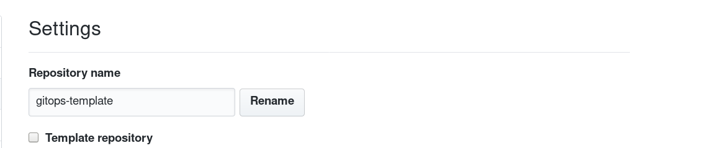

Project Initialize Operator - GitHub Integration
========================================

### Create Template Repository
Create a new repository and add the onboarding files that you wish to be available on all gitops repositories within the master branch of the new repository. Then set the repository as a template by going into the Settings of that repository and selecting the Template Repository selection box under repository name.



### Account Secret
A github account token is required to allow the operator to manage the creation of new repositories and branches. It must include under the data attribute a key of token with the value being the account token needed.

```
apiVersion: v1
data:
  token: <github-token>
kind: Secret
metadata:
  name: github
type: Opaque
```

Create this secret with the following command
```
$ oc create secret generic github --from-literal=token=<github-account-token>
```
